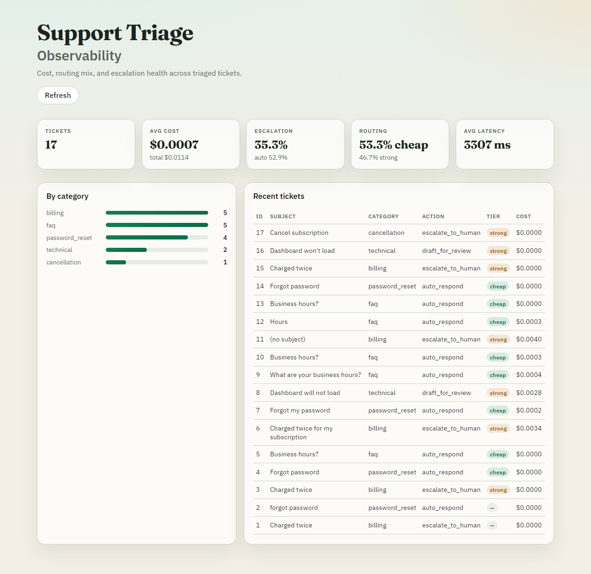
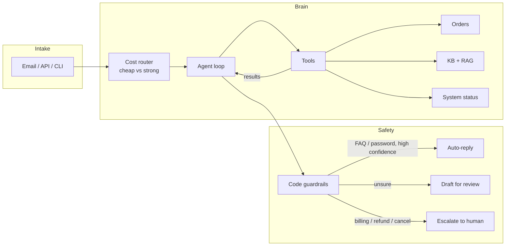

# Support-Ticket Triage Agent

**Most support queues are the same three questions on repeat - plus a few that can cost real money if you get them wrong.**

This agent takes those tickets (email or API), looks up what it needs, drafts a reply, then applies hard rules: FAQs can go out automatically; billing, refunds, and cancellations always go to a human.

| Gemini eval | Result |
|---|---|
| Category accuracy | **95.2%** |
| Action accuracy | **90.4%** |
| High-risk auto-respond | **0%** |



---

## Why this exists

| Before | After |
|---|---|
| Someone has to read every “what are your hours?” and “reset my password” | Those can auto-reply when the agent is sure |
| “Charged twice” sits in the same pile as FAQs | Money stuff always escalates — the model can’t auto-send it |
| Answers depend on whoever remembers the refund policy | Agent pulls policy from the knowledge base (RAG) first |
| You change a prompt and hope it’s still fine | Eval suite + dashboard so you can see accuracy, cost, escalations |

I wanted something that actually triages tickets end-to-end, without trusting the LLM alone on anything that touches money.

---

## What’s in the box

- Agent loop with tools (orders, knowledge base / RAG, status)
- Guardrails in code — money/lifecycle tickets can’t auto-send
- Email intake via AgentMail (auto-reply only when safe)
- Cheap vs strong model routing
- Eval suite + observability dashboard
- Mock LLM so you can run it with no API key

---

## Quick start

```bash
python -m venv .venv
# Windows: .venv\Scripts\Activate.ps1
# macOS/Linux: source .venv/bin/activate
pip install -r requirements.txt
copy .env.example .env          # Windows
# cp .env.example .env          # macOS / Linux
```

```bash
python -m app.cli                          # sample tickets, no API key
uvicorn app.api.main:app --reload          # http://127.0.0.1:8000/docs
pytest -q
```

Single ticket:

```bash
python -m app.cli --subject "Charged twice" --body "billed twice, customer_id: CUST-1001" --customer-id CUST-1001
```

Dashboard (API running): build once with `cd dashboard && npm run build`, then open http://127.0.0.1:8000/dashboard/ — or `npm run dev` in `dashboard/` for hot reload.

---

## How it works

One pipeline from intake to a **safe** action — the model proposes and code decides.



Tools decide what to fetch and guardrails decide what can auto-send. Every step is logged for the eval suite and dashboard.

---

## Advanced setup

<details>
<summary><strong>Gemini (optional)</strong></summary>

1. Free key: https://aistudio.google.com/apikey
2. In `.env`:
   ```env
   LLM_PROVIDER=gemini
   GEMINI_API_KEY=your_key_here
   GEMINI_MODEL=gemini-flash-lite-latest
   ENABLE_MODEL_ROUTING=true
   GEMINI_MODEL_CHEAP=gemini-flash-lite-latest
   GEMINI_MODEL_STRONG=gemini-flash-latest
   ```
3. Re-run CLI/API. Cost/tokens are logged per step (estimates; free tier bills $0).

Prefer `gemini-flash-lite-latest` for evals / cheap tier.

</details>

<details>
<summary><strong>RAG — Supabase + pgvector</strong></summary>

Tickets stay on SQLite (`DATABASE_URL`). Knowledge chunks use a separate Postgres URL.

1. Free project at [supabase.com](https://supabase.com)
2. SQL editor: `create extension if not exists vector;`
3. Copy **Transaction pooler** URI (port `6543`) into `.env`:
   ```env
   ENABLE_RAG=true
   RAG_DATABASE_URL=postgresql+psycopg://postgres.<ref>:<password>@aws-0-<region>.pooler.supabase.com:6543/postgres
   EMBEDDING_MODEL=gemini-embedding-001
   ```
4. `pip install -r requirements.txt` then `python -m app.rag.ingest`

`search_knowledge_base` returns `"source": "rag"` when live; otherwise keyword fallback.

Optional later: point `DATABASE_URL` at Postgres for tickets too (independent of RAG).

</details>

<details>
<summary><strong>AgentMail email intake</strong></summary>

Free tier includes send + receive. Auto-reply only when guardrails say `auto_respond`.

1. Key from [agentmail.to](https://www.agentmail.to) → `.env`:
   ```env
   AGENTMAIL_API_KEY=am_...
   AGENTMAIL_INBOX_USERNAME=support-triage
   AGENTMAIL_AUTO_REPLY=true
   ```
2. Free static domain: [ngrok Domains](https://dashboard.ngrok.com/domains)
3. API + tunnel:
   ```powershell
   uvicorn app.api.main:app --reload
   ngrok http --url=https://your-name.ngrok-free.dev 8000
   ```
4. One-time webhook register:
   ```powershell
   python -m app.email.setup --webhook-url https://your-name.ngrok-free.dev/webhooks/agentmail
   ```
5. Paste `AGENTMAIL_INBOX_ID` and `AGENTMAIL_WEBHOOK_SECRET` into `.env`.

Daily: only restart API + ngrok (same domain). Email `support-triage@agentmail.to`.

Endpoint: `POST /webhooks/agentmail`.

</details>

<details>
<summary><strong>Eval suite</strong></summary>

```bash
python -m evals.prepare_dataset              # needs `datasets`; regenerable
python -m evals.run_eval --provider mock --limit 50
python -m evals.run_eval --provider gemini --limit 20   # resumes from cache
```

Reports under `evals/results/`. Prefer Flash Lite for bulk runs.

</details>

---

## Project layout

```
app/
  agent/     # loop, prompts, guardrails, LLM providers, routing
  rag/       # embeddings, pgvector store, ingest
  tools/     # tool implementations + registry
  email/     # AgentMail webhook parse/handler/setup
  api/       # FastAPI + metrics + dashboard mount
  db/        # SQLAlchemy models
  service.py # triage orchestration
  cli.py
evals/       # prepare_dataset, run_eval, score
dashboard/   # React observability UI
docs/        # README screenshots
data/        # sample + eval tickets
tests/
```

---

## License

See [LICENSE](LICENSE).
